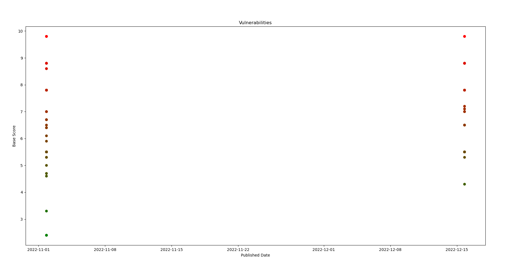

# NVD Scratching

Con el objetivo de analizar estas vulnerabilidades de manera eficiente, hemos creado un programa en Python que utiliza la API de nvd.nist.gov. Esto nos permite ordenar los incidentes por fecha de publicación, modificación y otras categorías relevantes. De esta manera, podemos identificar las vulnerabilidades más recientes y tomar medidas para proteger los sistemas.

Example:

> $ python3 NVD-graph.py

> $ python3 NVD-table.py
  
  <pre>               CVE             CWE            sourceIdentifier                published attackVector  baseScore
73  CVE-2022-42842  NVD-CWE-noinfo  product-security@apple.com  2022-12-15T19:15:23.837      NETWORK        9.8
70  CVE-2022-42837  NVD-CWE-noinfo  product-security@apple.com  2022-12-15T19:15:23.220      NETWORK        9.8
49  CVE-2022-42808         CWE-787  product-security@apple.com  2022-11-01T20:15:23.297      NETWORK        9.8
53  CVE-2022-42813         CWE-295  product-security@apple.com  2022-11-01T20:15:23.587      NETWORK        9.8
33  CVE-2022-32941         CWE-120  product-security@apple.com  2022-11-01T20:15:20.140      NETWORK        9.8
..             ...             ...                         ...                      ...          ...        ...
68  CVE-2022-32945         CWE-863  product-security@apple.com  2022-12-15T19:15:18.133      NETWORK        4.3
19  CVE-2022-32913  NVD-CWE-noinfo  product-security@apple.com  2022-11-01T20:15:19.233        LOCAL        3.3
6   CVE-2022-32867  NVD-CWE-noinfo  product-security@apple.com  2022-11-01T20:15:18.230     PHYSICAL        2.4
7   CVE-2022-32870  NVD-CWE-noinfo  product-security@apple.com  2022-11-01T20:15:18.277     PHYSICAL        2.4
9   CVE-2022-32879  NVD-CWE-noinfo  product-security@apple.com  2022-11-01T20:15:18.420     PHYSICAL        2.4

[102 rows x 6 columns]</pre>
